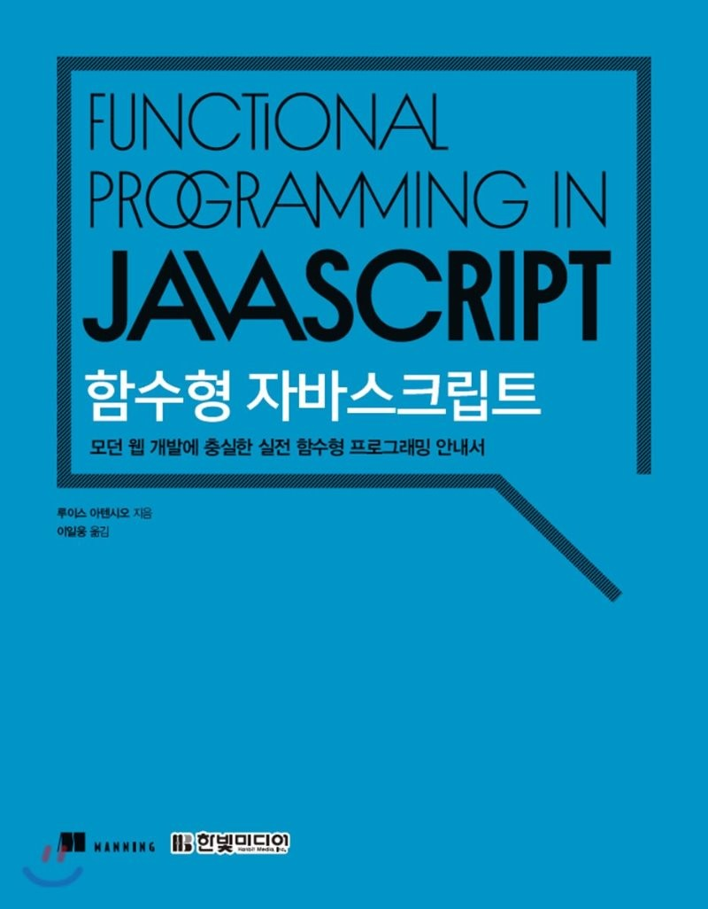
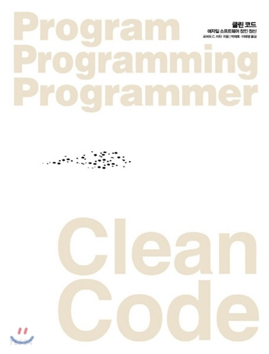
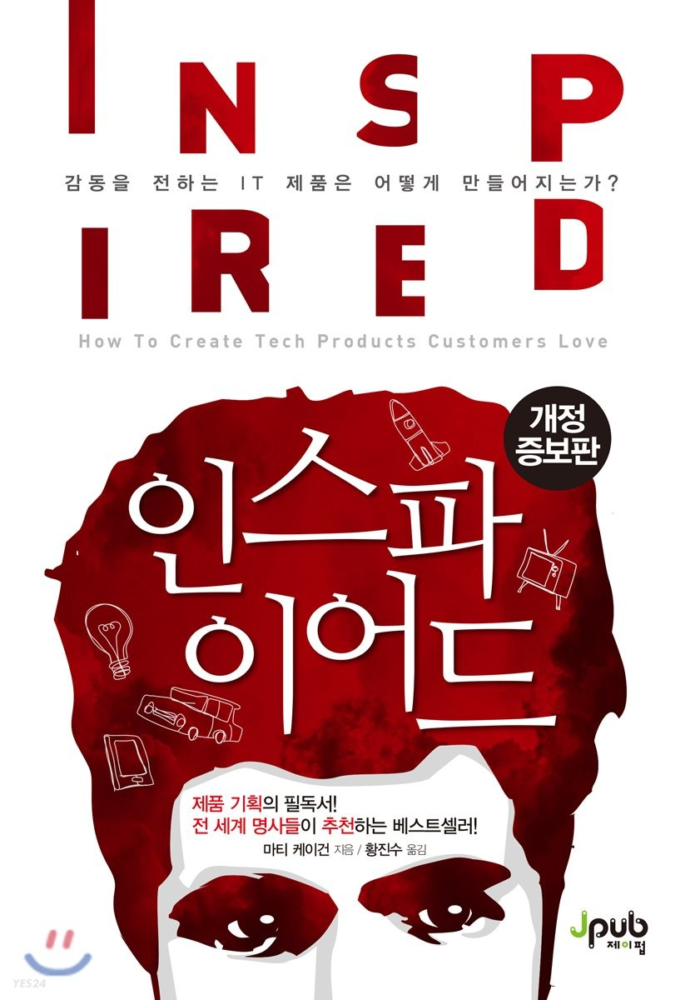
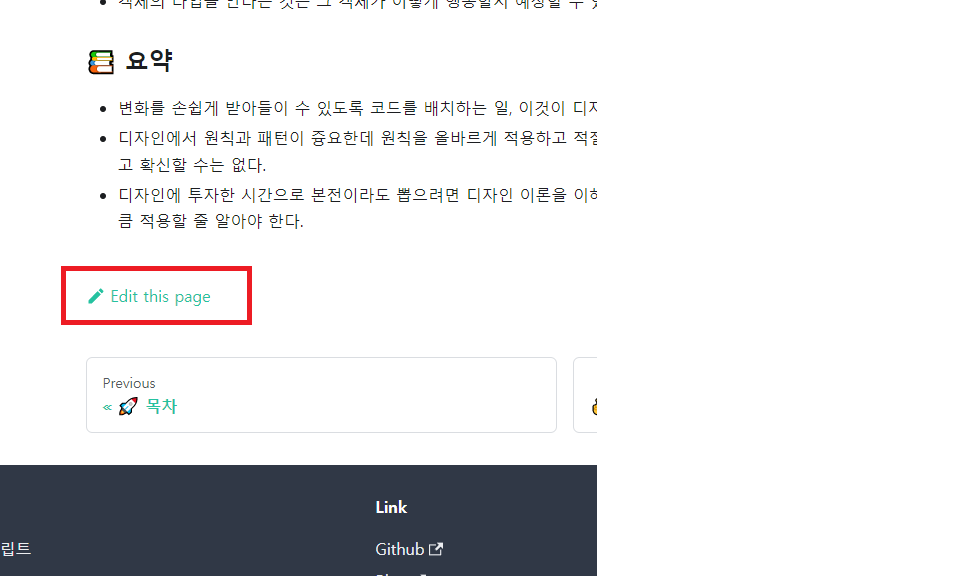

# ✌️ Reading books record repository
읽은 책들을 기록하고 정리하는 repository입니다.   

누구나 쉽게 기여할 수 있습니다! 🙏  ([여기](https://github.com/saseungmin/reading_books_record_repository#-%EC%BB%A8%ED%8A%B8%EB%A6%AC%EB%B7%B0%EC%85%98-%EB%B0%A9%EB%B2%95)를 참고해 주세요!)

## 📚 어디서 읽을까요?
#### 👉 [웹 사이트에서 읽기](https://saseungmin.github.io/reading_books_record_repository)
#### 👉 [Github MarkDown](https://github.com/saseungmin/reading_books_record_repository/tree/master/summarize_books_in_markdown)

## 💻 스터디를 진행한 책 목록
#### 기간 내에 정해진 분량의 책을 읽고 스터디를 진행합니다.

|[함수형 자바스크립트](https://github.com/saseungmin/reading_books_record_repository/tree/master/summarize_books_in_markdown/%ED%95%A8%EC%88%98%ED%98%95%20%EC%9E%90%EB%B0%94%EC%8A%A4%ED%81%AC%EB%A6%BD%ED%8A%B8)|[The Nature of Software Development](https://saseungmin.github.io/reading_books_record_repository/docs/agile/nature-of-software-development/table-of-contents)|[클린 애자일: 새로운 세대를 위한 애자일 가치와 실천](https://saseungmin.github.io/reading_books_record_repository/docs/agile/clean-agile/table-of-contents)|
|:---:|:---:|:---:|
||||
|[**객체지향의 사실과 오해: 역할, 책임, 협력 관점에서 본 객체지향**](https://saseungmin.github.io/reading_books_record_repository/docs/object-oriented/facts-and-misunderstandings/table-of-contents)|[**루비로 배우는 객체지향 디자인**](https://saseungmin.github.io/reading_books_record_repository/docs/object-oriented/design-in-ruby/table-of-contents)|[**엘리강트 오브젝트**](https://saseungmin.github.io/reading_books_record_repository/docs/object-oriented/elegant-object/table-of-contents)|
||||
|[**오브젝트**](https://saseungmin.github.io/reading_books_record_repository/docs/object-oriented/object/table-of-contents)|[**테스트 주도 개발로 배우는 객체 지향 설계와 실천**](https://saseungmin.github.io/reading_books_record_repository/docs/object-oriented/growing-object-oriented-software-guided-by-tests/table-of-contents)|[**린 UX(LEAN UX)**](https://saseungmin.github.io/reading_books_record_repository/docs/agile/lean-ux/table-of-contents)|
||||
|[**자바스크립트 패턴과 테스트**](https://github.com/saseungmin/reading_books_record_repository/tree/master/summarize_books_in_markdown/%EC%9E%90%EB%B0%94%EC%8A%A4%ED%81%AC%EB%A6%BD%ED%8A%B8%20%ED%8C%A8%ED%84%B4%EA%B3%BC%20%ED%85%8C%EC%8A%A4%ED%8A%B8)|[**리팩터링 2판**](https://github.com/saseungmin/reading_books_record_repository/tree/master/summarize_books_in_markdown/%EB%A6%AC%ED%8C%A9%ED%84%B0%EB%A7%81%202%ED%8C%90)|[**스칼라로 배우는 함수형 프로그래밍**](https://saseungmin.github.io/reading_books_record_repository/docs/functional/in-scala/table-of-contents)|
||||
|[**Clean Code(클린 코드)**](https://saseungmin.github.io/reading_books_record_repository/docs/clean/clean-code/table-of-contents)|||
||||

## 📚 읽은 책 목록
#### 책을 읽고 정리합니다. 읽은 책 혹은 읽고 있는 책 목록입니다.

|[자바스크립트 코딩의 기술](https://saseungmin.github.io/reading_books_record_repository/docs/javascript/modern-javascript/table-of-contents)|[Node.js 교과서](https://github.com/saseungmin/Node.js-tutorial)|[리액트를 다루는 기술](https://github.com/saseungmin/react-tutorial)|
|:---:|:---:|:---:|
||||
|[**You Don’t Know JS 타입과 문법, 스코프와 클로저**](https://github.com/saseungmin/reading_books_record_repository/tree/master/summarize_books_in_markdown/You%20Don%E2%80%99t%20Know%20JS%201)|[**Do it! 타입스크립트 프로그래밍**](https://saseungmin.github.io/reading_books_record_repository/docs/typescript/do-it-typescript/table-of-contents)|[**프로 Git 2판: 그림으로 이해하는 Git의 작동 원리와 사용법**](https://saseungmin.github.io/reading_books_record_repository/docs/git/pro-git-2/table-of-contents)|
||||
|[**코어 자바스크립트**](https://saseungmin.github.io/reading_books_record_repository/docs/javascript/core-javascript/table-of-contents)|[**쉽게 배우는 알고리즘**](https://github.com/saseungmin/reading_books_record_repository/tree/master/summarize_books_in_markdown/%EC%89%BD%EA%B2%8C%20%EB%B0%B0%EC%9A%B0%EB%8A%94%20%EC%95%8C%EA%B3%A0%EB%A6%AC%EC%A6%98)|[**함께 자라기**](https://saseungmin.github.io/reading_books_record_repository/docs/agile/growing-up-together/table-of-contents)|
||||
|[**실용주의 프로그래머**](https://saseungmin.github.io/reading_books_record_repository/docs/etc/pragmatic-programmer/table-of-contents)|[**인스파이어드**](https://saseungmin.github.io/reading_books_record_repository/docs/etc/inspired/table-of-contents)||
||||

## 🎯 읽을 책 목록
- You Don’t Know JS this와 객체 프로토타입, 비동기와 성능
- 클린 아키텍처 소프트웨어 구조와 설계의 원칙
- HTTP 완벽 가이드
- 테스트 주도 개발

## 🔥 컨트리뷰션 방법

#### 첫 번째 방법
1. 책이 정리된 [웹 사이트](https://saseungmin.github.io/reading_books_record_repository/)에 접속한다.
2. 정리된 책 내용 중 오탈자를 찾는다.
3. 각 페이지 하단에 아래 사진처럼 **Edit this page**를 클릭한다.

4. 오탈자를 수정 후 PR을 보낸다!

#### 두 번째 방법
1. Github Markdown에 정리된 [폴더](https://github.com/saseungmin/reading_books_record_repository/tree/master/summarize_books_in_markdown)로 이동한다.
2. 정리된 책 내용 중 오탈자를 찾는다.
3. 오탈자를 수정 후 PR을 보낸다!

오탈자가 많아서 쉽게 찾으실 수 있을겁니다. 🙏

## 🔒 LICENSE
This Project is [MIT licensed](https://github.com/saseungmin/reading_books_record_repository/blob/master/LICENSE).
