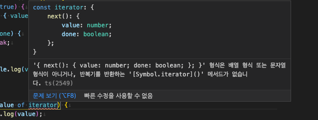

# 🐤 Chapter 6: 반복기 이해하기

## 🦄 반복기 이해하기

### 📚 반복기와 반복기 제공자
- 반복기(iterator)는 다음과 같은 특징이 있는 객체이다.

> 1. `next`라는 이름의 메서드를 제공한다.
> 2. `next` 메서드는 `value`와 `done`이라는 두 개의 속성을 가진 객체를 반환한다.

- 다음 코드에서 `createRangeIterable` 함수는 `next` 메서드가 있는 객체를 반환하므로 이 함수는 반복기를 제공하는 역할을 한다. 이처럼 반복기를 제공하는 함수를 반복기 제공자(iterable)라고 한다.

```ts
export const createRangeIterable = (from: number, to: number) => {
  let currentValue = from;

  return {
    next() {
      const value = currentValue < to ? currentValue++ : undefined;
      const done = value === undefined;

      return { value, done };
    }
  }
}
```

- 다음은 `createRangeIterable` 함수가 제공하는 반복기를 사용하는 예이다.

```ts
import { createRangeIterable } from './createRangeIterable';

const iterator = createRangeIterable(1, 3 + 1); // 반복기는 현재 동작하지 않는다.

while (true) {
  const { value, done } = iterator.next();

  if (done) {
    break;
  }

  console.log(value);
}
```

- `createRangeIterable` 함수를 호출해 반복기를 얻고 `iterator` 변수에 저장하고 반복기는 이처럼 반복기 제공자를 호출해야만 얻을 수 있다.

### 📚 반복기는 왜 필요한가?
- 반복기 제공자는 어떤 범위의 값을 한꺼번에 생성해서 배열에 담지 않고 값이 필요할 때만 생성한다.
- 다음은 5장의 `range` 함수이다.

```ts
export const range = (from, to) => from < to ? [from, ...range(from + 1, to)] : [];
```

- `createRangeIterable` 함수는 값이 필요한 시점에 비로소 생성하지만, `range` 함수는 값이 필요한 시점보다 이전에 미리 생성한다. 따라서 시스템 메모리의 효율성이라는 과점에서 보면 `createRangeIterable` 함수가 메모리를 훨씬 적게 소모한다.

### 📚 for...of 구문과 [Symbol.iterator] 메서드
- 5장의 `range` 함수는 `for...of` 구문의 `of`뒤에 올 수 있다.

```ts
for (let value of range(1, 3 + 1)) {
  console.log(value); // 1 2 3
}
```

- 그러나 다음 코드처럼 앞에서 작성한 `createRangeIterable` 함수를 `for...of` 구문에 적용하면 `[Symbol.iterator]() 메서드가 없다`는 오류가 발생한다.

```ts
const iterable = createRangeIterable(1, 3 + 1);
for(let value of iterable) {
  console.log(value);
}
```



- 이 오류는 `createRangeIterable` 함수를 다음 `RangeIterable`처럼 클래스로 구현해야 한다는 것을 의미한다.
- `RangeIterable` 클래스는 `[Symbol.iterator]` 메서드를 구현하고 있다.

```ts
class RangeIterable {
  constructor(public from: number, public to: number) {};

  [Symbol.iterator]() {
    const that = this;
    let currentValue = that.from;

    return {
      next() {
        const value = currentValue < that.to ? currentValue++ : undefined;
        const done = value === undefined;
  
        return { value, done };
      }
    }
  }
}

const iterator = new RangeIterable(1, 3 + 1);

for (const value of iterator) {
  console.log(value); // 1 2 3
}
```

### 📚 Iterable<T>와 Iterator<T> 인터페이스
- 타입스크립트는 반복기 제공자에 `Iterable<T>`와 `Iterator<T>` 제네릭 인터페이스를 사용할 수 있다. `Iterable<T>`는 다음처럼 자신을 구현하는 클래스가 `[Symbol.iterator]` 메서드를 제공한다는 것을 명확하게 알려주는 역할을 한다.

```ts
class 구현클래스 implements Iterable<생성할_값의_타입> {}
```

- `Iterator<T>`는 반복기가 생성할 값의 타입을 명확하게 해준다.

```ts
[Symbol.iterator](): Iterator<생성할_값을_타입> {}
```

- 다음은 반복기 제공자를 타입스크립트가 제공하는 `Iterable<T>`와 `Iterator<T>`를 사용해 구현한 예이다.

```ts
export class StringIterable implements Iterable<string> {
  constructor(private strings: string[] = [], private currentIndex: number = 0) {}

  [Symbol.iterator](): Iterator<string> {
    const that = this;
    let currentIndex = that.currentIndex;
    let length = that.strings.length;

    const iterator: Iterator<string> = {
      next(): { value: string, done: boolean } {
        const value = currentIndex < length ? that.strings[currentIndex] : undefined;
        const done = value === undefined;

        return { value, done };
      }
    }

    return iterator;
  }
}

for (let value of new StringIterable(['hello', 'world', '!'])) {
  console.log(value); // hello world !
}
```

## 🦄 생성기 이해하기
- `yield`는 마치 `return` 키워드처럼 값을 반환한다. `yield`는 반드시 `function*` 키워드를 사용한 함수에서만 호출할 수 있다. 여기서 `function*` 키워드로 만든 함수를 생성기(generator)라고 부른다.

```ts
export function* generator() {
  console.log('start');
  let value = 1;

  while (value < 4) {
    yield value++;
  }

  console.log('finish');
};

for (const value of generator()) {
  console.log(value);
  // start
  // 1
  // 2
  // 3
  // finish
}
```

### 📚 setInterval 함수와 생성기의 유사성
- 생성기가 동작하는 방식을 세미코루틴(semi-coroutine)이라고 한다.
- 세미코루틴은 타입스크립트처럼 단일 스레드로 동작하는 프로그래밍 언어가 마치 다중 스레드로 동작하는 것처럼 보이게 하는 기능을 한다.
- `setInterval` 함수는 무한히 반복하지만 `clearInterval` 함수를 사용하면 멈출 수 있다.

```ts
const period = 1000;
let count = 0;

console.log('program started...');
const id = setInterval(() => {
  if (count >= 3) {
    clearInterval(id);
    console.log('program finished');
  } else {
    console.log(++count);
  }
}, period);

// program started...
// 1
// 2
// 3
// program finished...
```

- `setInterval`을 동작시킨 부분이 메인 스레드, `setInterval`의 콜백 함수는 작업 스레드를 떠올리게 하낟. 생성기는 이처럼 일반적인 타입스크립트 코드와는 좀 다른 방식으로 동작한다.

> - 코루틴은 애플리케이션 레벨의 스레드이다. 코루틴의 목적은 운영체제에 부담을 주지 않으면서 애플리케이션에서 스레드를 마음껏 쓸 수 있게 하는 것이다. 그런데 코루틴은 스레드이므로 일정 주기에 따라 자동으로 반복해서 실행된다.
> - 반면에 생성기는 절반만 코루틴이다. 즉, 반복해서 실행할 수 있지만 자동으로 실행되지 못하는 코루틴이다. 생성기가 만들어준 반복자의 `next` 호출 때 한 번 실행되고 곧바로 멈춘다. 이처럼 생성기는 자동으로 반복 실행되지 않으므로 세미코루틴이라고 한다.

### 📚 function* 키워드
- `generator` 함수와 일반 함수와 다른점

> 1. `function*` 키워드로 함수를 선언한다.
> 2. 함수 몸통 안에 `yield` 문이 있다.

- 즉, `function*` 키워드로 선언된 함수가 생성기인데, 생성기는 오직 `function*` 키워드로 선언해야 하므로 화살표 함수로는 생성기를 만들 수 업삳.

### 📚 yield 키워드
- 생성기 함수 안에는 `yield` 문을 사용할 수 있다. `yield`는 연산자 형태로 동작하며 다음처럼 두 가지 기능을 한다.

> 1. 반복기를 자동으로 만들어 준다.
> 2. 반복기 제공자 역할도 수행한다.

```ts
export function* rangeGenerator(from: number, to: number) {
  let value = from;

  while(value < to) {
    yield value++;
  }
}

let iterator = rangeGenerator(1, 3 + 1);

while (1) {
  const { value, done } = iterator.next();

  if (done) {
    break;
  }

  console.log(value); // 1 2 3
}

for (const value of rangeGenerator(4, 6 + 1)) {
  console.log(value); // 4 5 6
}
```

### 📚 반복기 제공자의 메서드로 동작하는 생성기 구현
- `StringIterable` 클래스를 생성기를 사용하면 간결하게 구현할 수 있다.

```ts
export class IterableUsingGenerator implements Iterable<string> {
  constructor(private values: string[] = [], private currentIndex: number = 0) {}

  [Symbol.iterator] = function* () {
    while(this.currentIndex < this.values.length) {
      yield this.values[this.currentIndex++];
    }
  }
}

for (const item of new IterableUsingGenerator([1, 2, 3])) {
  console.log(item);
}

for (const item of new IterableUsingGenerator(['hello', 'world', '!'])) {
  console.log(item);
}
```

### 📚 yield* 키워드
- `yield*`는 다른 생성기나 배열을 대상으로 동작한다.

```ts
function* gen12() {
  yield 1;
  yield 2;
}

export function* gen12345() {
  yield* gen12();
  yield* [3, 4];
  yield 5;
}
```

### 📚 yield 반환값
- `yield` 연산자는 값을 반환한다.

```ts
export function* gen() {
  let count = 5;
  let select = 0;

  while(count--) {
    select = yield `you select ${select}`;
  }
}

export const random = (max, min = 0) => Math.round(Math.random() * (max - min)) + min;
```

- `yield` 연산자의 반환값은 반복기의 `next` 메서드 호출 때 매개변수에 전달하는 값이다.
- `next` 메서드 호출 때 난수를 생성해 전달한다.

```ts
const iter = gen();

while(true) {
  const { value, done } = iter.next(random(10, 1));

  if(done) {
    break;
  }

  console.log(value);
  // you select 0
  // you select 3
  // you select 9
  // you select 2
  // you select 9
}
```

- 실행 결과는 이전에 `next` 메서드가 전달한 값이 다시 `gen` 함수의 내부 로직에 의해 현재의 `value` 값이 되어 출력된다.
